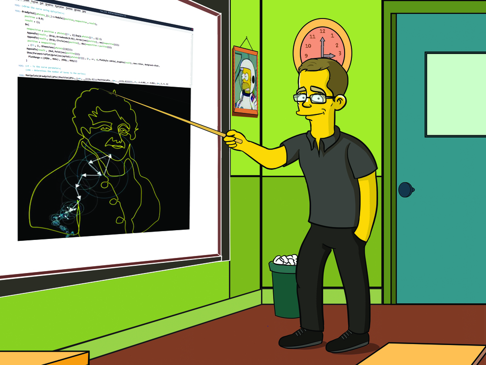

# TOC

* [Contact](#contact)
* [Teaching](#teaching)
	* [Algorithms and Data Structures (computer lab, summer 2019-2020)](#algorithms-and-data-structures-computer-lab-summer-2019-2020)
		* [Set 1](#set-1)
	* [Algebra and Geometry (practical classes, 2019-2020)](#algebra-and-geometry-practical-classes-2019-2020)
* [Fun](#fun)
	* [Podcasts](#podcasts)

# Contact

* where: Jagiellonian University, Faculty of Physics Astronomy and Applied computer Science
* e-mail: kacper.topolnicki@uj.edu.pl
* adress: prof. St. Łojasiewicza 11, 30-348 Kraków, Poland
* room: B-2-25
* tel.: (+48) 12 664 4869  

[↑](#toc "toc")[→](#teaching "teaching")

# Teaching

[←](#contact "contact")[↑](#toc "toc")[→](#fun "fun")

## Algorithms and Data Structures (computer lab, summer 2019-2020)

A new set of exercises will be made available, on average every week. Each 
exercise can be implemented in your language of choice, with some caveats:

* Please don't use languages that rely strongly on functional programming
  (e.g. haskell, lisp) because your solutions might diverge from the 
  lectured material. 
* The aim of the exercises is to implement the algorithms from
  scratch so please don't use existing libraries. 

At the end of the semester you will be graded based
on the number of exercises that were solved (the grading curve will be
determined at the end of the semester). Submitting solutions:

* Solutions to exercises can be sent to <kacper.topolnicki@uj.edu.pl> from
  your university (!) e-mail address. 
* The title of the message must contain the word "hornswogglingrabidrabbit"
  surrounded by white spaces, the set, and exercise numbers.
* The attachment  should have a `.zip` file with your program. 
  * The `.zip` archive should unpack to a single directory
    with a bash script `run` that does all the work.  

All programs will be ran inside a virtual machine with Ubuntu 
in case any of you want to try some funny business :-)

There will additionally be a test (related to concepts from the lecture)
and a final project. You need a positive grade from the exercises, the test,
and the project to get a positive final grade. The final grade will be a weighted
average:

* number of exercises (60%)
* test (20%)
* final project (20%)

[↑](#teaching "teaching")[→](#algebra-and-geometry-practical-classes-2019-2020 "algebra and geometry practical classes 2019 2020")

### Set 1

1. $\frac{1}{1 + \frac{1}{1 + \frac{1}{1 + \frac{1}{1 + \frac{1}{1 + \pi}}}}}$
2. $e = \lim\limits_{n \to \infty} \left(1 + \frac{1}{n} \right)^{n}$

[↑](#algorithms-and-data-structures-computer-lab-summer-2019-2020 "algorithms and data structures computer lab summer 2019 2020")

## Algebra and Geometry (practical classes, 2019-2020)

[←](#algorithms-and-data-structures-computer-lab-summer-2019-2020 "algorithms and data structures computer lab summer 2019 2020")[↑](#teaching "teaching")

# Fun

[←](#teaching "teaching")[↑](#toc "toc")

## Podcasts

* [Radiolab](https://www.npr.org/podcasts/452538884/radiolab) 

  Fantastic radio, a temple of curiosity. Various topics ranging from parasites and numbers to cannibals and cowbells.

* [The Portal](https://www.youtube.com/user/nobani88) 

  Interesting long form conversations with intellectuals, academics, chess grand masters ... and many more. The Host 
  [Eric Weisstein](https://en.wikipedia.org/wiki/Eric_W._Weisstein)
  is a physicist and creator of the popular site [MathWorld](http://mathworld.wolfram.com/).

* [Making Sense](https://samharris.org/podcast/) 

  Long form conversations about current events, meditation, atheism, consciousness, nature of reality, artificial intelligence and much more.

* [Joe Rogan Experience](https://www.youtube.com/user/PowerfulJRE) 

  Long conversations. From silly to funny to goofy to serious. Lot's of chimpanzees, Elon Musk smoking weed and Sir Roger Penrose.

* [Freakonomics](http://freakonomics.com/) 

  Various topics around economics. Fascinating stuff. Shorter conversations, around one hour.

* [Planet Money](https://www.npr.org/sections/money/) 

	Dolla dolla bill y'all!

* [Stuff You Schould Know](https://www.howstuffworks.com/) 

  Interesting things ... that You Schould Know :-)

* [99% Invisible](http://99percentinvisible.org/) 

  Design and architecture.

* [The Moth](https://themoth.org/) 

  Wonderfull short stories.

 

[↑](#fun "fun")

